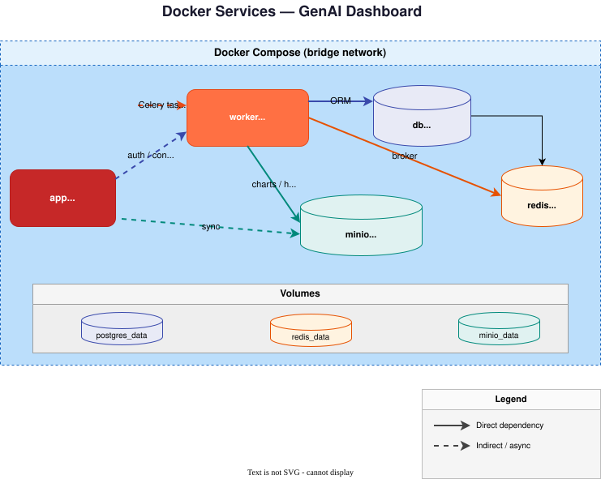
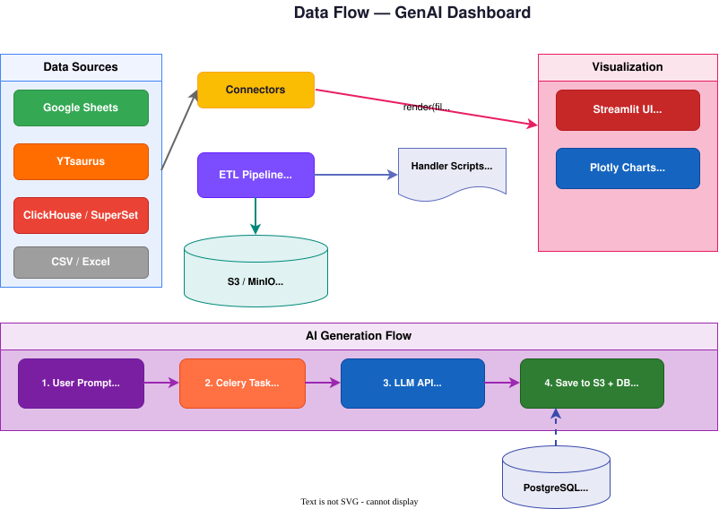

# 📊 GenAI Dashboard
/drawio


**Интерактивная аналитическая платформа с интеграцией Generative AI.**

Объединяет данные из Google Sheets и корпоративных хранилищ (YTsaurus / ClickHouse) в едином дашборде. Строит графики по текстовому описанию, управляет ETL-пайплайнами и позволяет командам работать в общих воркспейсах.

---

## 🚀 Быстрый старт

```bash
git clone https://github.com/MaxSh0/GenAI_DashBoard.git
cd GenAI_DashBoard
docker compose up --build
```

Приложение доступно на **[http://localhost:8501](http://localhost:8501)**.

При первом запуске автоматически:
- Создаётся папка `config/` с шаблонами конфигурации
- Инициализируются таблицы PostgreSQL
- Создаются S3-бакеты в MinIO (`charts`, `handlers`, `data-sources`)

> Запуск **только через Docker**. Локальный запуск без контейнеров больше не поддерживается.

---

## ✨ Ключевые возможности

### 🤖 AI-Powered Analytics
Создание графиков на естественном языке. Опишите, что хотите увидеть — AI сгенерирует готовый Plotly-код.

- **Text-to-Chart** — график по текстовому описанию с учётом структуры данных
- **AI-редактирование** — доработка существующих графиков через prompt
- **AI-аналитика** — автоматический поиск трендов, аномалий и бизнес-инсайтов
- **Модели:** OpenAI (GPT-4o), Google Gemini, DeepSeek и любые OpenAI-совместимые прокси

### 🔌 Универсальные коннекторы данных

| Коннектор | Источник |
| --- | --- |
| 📄 Google Sheets | Живая синхронизация с таблицами через gspread |
| 🦖 YTsaurus | YQL-запросы к кластерам YTsaurus |
| ⚡ ClickHouse / SuperSet | SQL-запросы через REST API |
| 📁 Локальные файлы | CSV и Excel, загруженные вручную |

### 🛠️ ETL-пайплайны
Встроенный редактор Python-скриптов для трансформации данных. Каждый источник можно пропустить через обработчик `handle(df)`:
- Применяется автоматически при каждом обновлении источника
- Код хранится в S3 и синхронизируется между контейнерами
- Тяжёлые ETL-задачи выполняются асинхронно через Celery

### 👥 Мультитенантность
Система воркспейсов с гибким разделением доступа:
- **Личное пространство** у каждого пользователя
- **Общие воркспейсы** с ролями (владелец / участник)
- Все сущности — графики, страницы, источники, обработчики — изолированы в рамках воркспейса

### 📦 Импорт / Экспорт
Графики упаковываются в `.geb` архивы (ZIP) вместе с данными:
- Перенос между воркспейсами и инсталляциями
- Автоматическое разрешение конфликтов имён при импорте
- Сборка архива в фоновом режиме через Celery

---

## 🏗 Архитектура

### Docker-сервисы



| Сервис | Назначение | Порт |
| --- | --- | --- |
| **app** | Streamlit UI — интерфейс пользователя | `8501` |
| **worker** | Celery — 8 фоновых задач (AI, ETL, экспорт) | — |
| **db** | PostgreSQL 15 — ORM, пользователи, конфигурация | `5432` |
| **redis** | Redis 7 — брокер сообщений для Celery | `6379` |
| **minio** | MinIO — S3-совместимое файловое хранилище | `9000`, `9001` |

### Поток данных



### Как работает AI-генерация

1. Пользователь заполняет цель, пожелания к дизайну и выбирает данные
2. Формируется prompt с метаданными колонок и цветовой палитрой
3. Задача отправляется в **Celery** → вызывается LLM API (OpenAI / Gemini / DeepSeek)
4. Сгенерированный Python-код (функция `render(files, chart_key)`) сохраняется в S3 и регистрируется в БД
5. Streamlit подхватывает результат через polling-трекер (каждые 2 секунды)

---

## 📁 Структура проекта

```text
GenAI_DashBoard/
├── app.py                         # Точка входа — Streamlit UI + роутинг
├── modules/                       # Ядро платформы
│   ├── auth.py                    #   Google OAuth 2.0 (токены в БД)
│   ├── models.py                  #   SQLAlchemy ORM (8 моделей)
│   ├── db_manager.py              #   Подключение к PostgreSQL
│   ├── llm_manager.py             #   AI-слой (шифрование ключей, API-запросы)
│   ├── data_loader.py             #   ETL-пайплайн (Extract → Transform → Load)
│   ├── connector_loader.py        #   Динамический импорт плагинов-коннекторов
│   ├── connectors/                #   Коннекторы источников данных
│   │   ├── base.py                #     Абстрактный класс BaseConnector
│   │   ├── gsheets.py             #     Google Sheets (gspread)
│   │   ├── ytsaurus.py            #     YTsaurus (YQL)
│   │   └── superset.py            #     ClickHouse / SuperSet API
│   ├── tasks.py                   #   Celery-задачи (8 фоновых задач)
│   ├── wizards.py                 #   Streamlit-диалоги
│   ├── io_manager.py              #   Импорт/экспорт .geb бандлов
│   ├── s3_storage.py              #   MinIO S3 клиент (Singleton)
│   ├── settings.py                #   Конфигурация путей и констант
│   └── utils.py                   #   Шифрование, экспорт HTML, хелперы
├── handlers/                      # ETL-скрипты пользователей (handle.py)
├── charts/                        # Сгенерированные AI графики (.py)
├── data_sources/                  # Файлы данных (CSV, Excel, .geb)
├── config/                        # Конфигурация (создаётся автоматически)
│   ├── client_secret.json         #   Google OAuth ключи
│   └── users.yaml                 #   Пользователи streamlit-authenticator
├── debug_utils/                   # Утилиты (создание пользователей, миграции)
├── Dockerfile                     # Сборка образа (python:3.13-slim)
├── docker-compose.yml             # Оркестрация 5 сервисов
├── entrypoint.sh                  # Точка входа контейнера
├── .flake8                        # Конфигурация линтера
├── CLAUDE.md                      # Контекст для AI-агентов
└── requirements.txt               # Python-зависимости
```

---

## ⚙️ Настройка интеграций

### Google OAuth 2.0

1. Создайте проект в [Google Cloud Console](https://console.cloud.google.com/)
2. Создайте OAuth 2.0 Client ID (тип **Web application**)
3. Добавьте `http://localhost:8501` в Authorized redirect URIs
4. Скачайте JSON и положите как `config/client_secret.json`
5. Включите **Google Sheets API** и **Google Drive API** в библиотеке API

Либо используйте встроенный мастер настройки — кнопка «⚙️ Настроить Google» на экране входа.

### AI-провайдеры

API-ключи вводятся в интерфейсе приложения:

1. Войдите в систему
2. Откройте сайдбар → 🧠 AI Настройки
3. Добавьте интеграцию: тип API, ключ, список моделей

Ключи шифруются (Fernet) и хранятся в PostgreSQL. Поддерживаются любые OpenAI-совместимые прокси (укажите Base URL).

---

## 📞 Команда и Обратная связь

Если у вас возникли проблемы при запуске, есть идеи по улучшению или вы нашли баг, пожалуйста, свяжитесь с нами:

- **Project Manager, Testing, Developer**
- 📩 [darya.markarova.v@gmail.com](mailto:darya.markarova.v@gmail.com)


- **Developer, AI Tools**
- 📩 [m.shakurov99@gmail.com](mailto:m.shakurov99@gmail.com)

---

*Developed with ❤️ by MaxSh0 and MarkarovaDV*

---

## 📄 Лицензия

[MIT](https://opensource.org/licenses/MIT)
